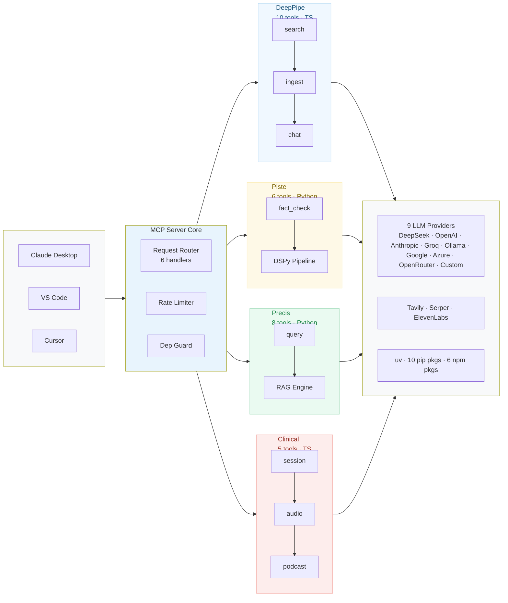

# mcp-agentic-pipelines

> **One MCP server. Five AI pipelines. Thirty-one tools. Zero manual setup.**

Composable, agentic AI pipelines for Anthropic's Model Context Protocol. Fact-check claims with DSPy, search documents with hybrid RAG, extract intelligence with DeepPipe, and run clinical voice intake — all from a single MCP server. Designed for Claude Desktop, VS Code, Cursor, and any MCP-compatible client.

---

## All 31 Tools

### 🔍 DeepPipe — Document Intelligence (10 tools)
| Tool | What it does |
|---|---|
| `deeppipe_search` | Full-text + vector hybrid search across all documents |
| `deeppipe_ingest` | Ingest raw text/JSON documents for indexing |
| `deeppipe_ingest_file` | Ingest documents directly from file paths |
| `deeppipe_chat_context` | RAG-style Q&A with source citations |
| `deeppipe_extractive_answer` | Extract a precise answer from documents |
| `deeppipe_list_documents` | List all indexed documents with metadata |
| `deeppipe_get_document` | Retrieve a specific document by ID |
| `deeppipe_get_text` | Get the full text content of a document |
| `deeppipe_remove_document` | Remove a document from the index |
| `deeppipe_stats` | View index statistics and document count |

### 🧠 Piste — Fact-Checking (6 tools)
| Tool | What it does |
|---|---|
| `piste_fact_check` | Run a claim through the full 4-stage DSPy pipeline (retrieval → verification → aggregation → verdict) |
| `piste_list_verdicts` | Browse all past fact-check verdicts |
| `piste_replay` | Replay the audit trail of any fact-check run |
| `piste_get_audit` | Get the detailed reasoning chain for a verdict |
| `piste_get_verdict` | Retrieve a specific verdict by claim ID |
| `piste_submit_feedback` | Submit human feedback to improve future checks |

### 📚 Precis — RAG Pipeline (8 tools)
| Tool | What it does |
|---|---|
| `precis_query` | Full RAG query — hybrid search + LLM answer generation |
| `precis_list_documents` | List all documents in the RAG corpus |
| `precis_debug_stem` | Inspect how the stemmer processes a query |
| `precis_debug_search` | See raw hybrid search results (before LLM) |
| `precis_upload_document` | Upload a document to the RAG corpus |
| `precis_upload_batch` | Batch-upload multiple documents at once |
| `precis_extract_work_order` | Extract structured work orders from documents |
| `precis_list_work_orders` | Browse all extracted work orders |

### 🎙️ Clinical — Voice Intake (5 tools)
| Tool | What it does |
|---|---|
| `clinical_start_session` | Start a new voice intake session (returns session ID) |
| `clinical_process_audio` | Send audio → STT transcription → SOAP notes |
| `clinical_generate_podcast` | Generate a clinical podcast from session notes |
| `clinical_list_sessions` | List all voice intake sessions |
| `clinical_get_session` | Get full details of a specific session |

### ⚙️ Built-in (2 tools)
| Tool | What it does |
|---|---|
| `mcp_health` | Server health, tool count, provider status |
| `mcp_list_providers` | List all 9 supported LLM providers |

---

## Compose Pipelines Together

These tools are designed to be chained. Here's a real workflow:

```
1. deeppipe_ingest           → Load a research paper into the index
2. precis_upload_document    → Add it to the RAG corpus
3. deeppipe_search           → Find relevant passages
4. piste_fact_check          → Verify claims found in those passages
5. precis_query              → Generate a RAG answer from verified context
6. clinical_start_session    → Start voice notes on the findings
7. clinical_generate_podcast → Turn it all into a shareable podcast
```

**In Claude Desktop, this is a conversation:**
> *"Search my documents for claims about climate policy, fact-check each one,
> then generate a clinical podcast summarizing the verified findings."*

Claude orchestrates the tool calls — your server provides the pipelines.

---

## Architecture



---

## Quick Start

```bash
# 1. Install (npm + Python deps handled automatically)
npx mcp-agentic-pipelines setup

# 2. Start the server
npx mcp-agentic-pipelines

# 3. Or run the test suite
npx mcp-agentic-pipelines test
```

### MCP Client Configuration

Add to your MCP client config:

```json
{
  "mcpServers": {
    "mcp-agentic-pipelines": {
      "command": "npx",
      "args": ["mcp-agentic-pipelines"]
    }
  }
}
```

### Environment Variables

Copy `.env.example` to `.env` and set your keys:

| Key | Purpose |
|---|---|
| `DEEPSEEK_API_KEY` | Default LLM (DeepSeek) |
| `OPENAI_API_KEY` | Fallback LLM |
| `GROQ_API_KEY` | Clinical voice (STT) |
| `ELEVENLABS_API_KEY` | Clinical voice (TTS) |
| `TAVILY_API_KEY` | Piste web search |
| `SERPER_API_KEY` | Piste web search |

*Server starts with any subset — missing keys skip their tools gracefully.*

---

## Requirements

- **Node.js ≥ 18**
- **Python 3.11+** (automatically managed via `uv` — no manual Python install needed on Linux/macOS)
- **API keys** for the tools you want to use (DeepSeek, Groq, ElevenLabs, Tavily, etc.)

---

## Development

```bash
git clone https://github.com/jinan-kordab/mcp-agentic-pipelines.git
cd mcp-agentic-pipelines
npm install
node setup.mjs        # one-time — installs all Python deps
node test.mjs         # runs all 31 tool tests
```

---

## Architecture (Directory)

```
packages/
├── core/          Shared types, config, logging, Python bridge
├── server/        MCP entry point, request routing
├── deeppipe/      10 document intelligence tools
├── piste/         6 fact-checking tools (Python bridge → DSPy)
├── precis/        8 RAG tools (Python bridge → hybrid search)
├── clinical/      5 voice intake tools (native TypeScript)
vendors/
├── piste/         DSPy pipeline modules + stdin/stdout bridge
├── precis/        RAG backend modules + stdin/stdout bridge
├── clinical-intake/  Voice pipeline (npm workspace)
setup.mjs          One-time setup (uv, npm, pip)
test.mjs           Complete test suite (31 tools)
```

---

## License

MIT © [Jinan Kordab](https://github.com/jinan-kordab)


---

## Architecture

```
packages/
├── core/          Shared types, config, logging, Python bridge
├── server/        MCP entry point, request routing
├── deeppipe/      10 document intelligence tools
├── piste/         6 fact-checking tools (Python bridge → DSPy)
├── precis/        8 RAG tools (Python bridge → hybrid search)
├── clinical/      5 voice intake tools (native TypeScript)
vendors/
├── piste/         DSPy pipeline modules + stdin/stdout bridge
├── precis/        RAG backend modules + stdin/stdout bridge
├── clinical-intake/  Voice pipeline (npm workspace)
setup.mjs          One-time setup (uv, npm, pip)
test.mjs           Complete test suite (31 tools)
```

---

## License

MIT © [Jinan Kordab](https://github.com/jinan-kordab)
